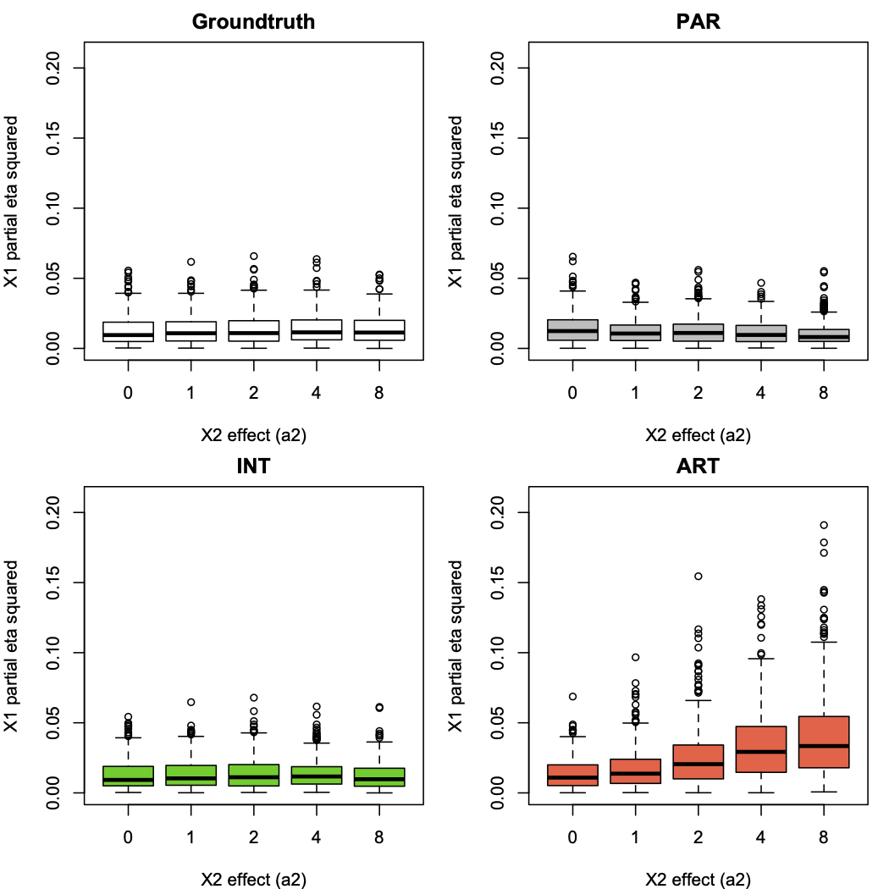
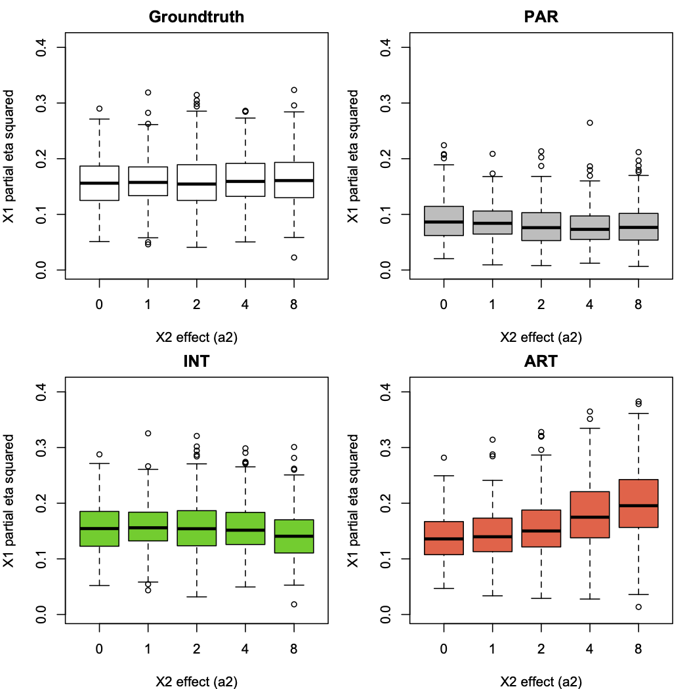
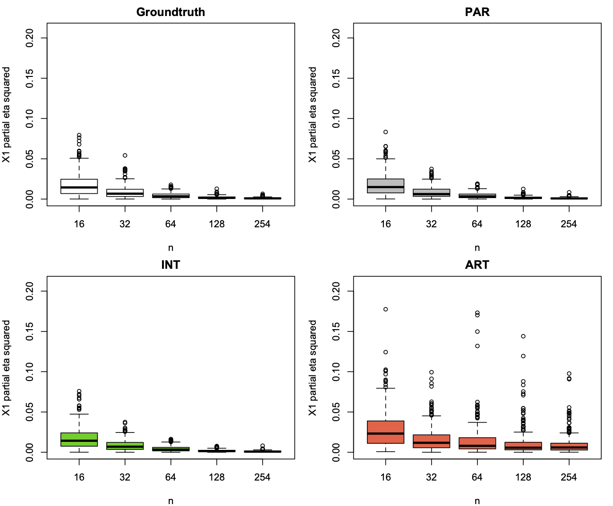

I found some time to add some data on effects sizes to respond to @mutrussel. 

Code for these analyses is provided [here](https://github.com/journalovi/2024-tsandilas-ranktransforms/tree/main/supplementary/rebuttals/effect-size): 

### Relationship between effect-size estimates and *p*-values

**If we keep the sample size fixed**, there is a clear relationship between *p*-values and estimates of effects sizes. For example, the following graph show the relationship between the logarithm of the *p*-values and the partial $\eta^2$ (eta squared) returned by ANOVA for the first factor of a 4x3 repeated-measures design when $n = 20$.

Thus, large discrepancies in *p*-values across different methods (particularly in orders of magnitude) also translate to discrepancies in their effect-size estimates.

### Observing how ART confounds effects in heavy-tailed distributions

Now, let's demonstrate ART's issues by observing the estimated partial $\eta^2$ for the first factor $X_1$, as we increase the effect on the second factor $X_2$. To do so, we increase the model coefficient $a_2$, while $a_1 = 0$ and $a_{12} = 0$. Below, we show results for log-normal distributions with $n=20$ and 300 data points for each level of $a_2$:

The ground-truth method is the ideal approach of using ANOVA on the latent normal scale. We observe that ART is the only method affected by an increase in the magnitude of the effect on $X_2$. PAR's effect-size estimates for $X_1$ remain unaffected. This clearly illustrates that ART's failure is due to its alignment mechanism, which confounds effects under such distributions. 

### Estimation of non-null effects
Now, let's examine what happens when there is actually an effect on $X_1$, by setting $a_1 = 1$:

We observe that PAR is not ideal for such data, as it consistently underestimates effects. Note that ART tends to underestimate effects when $a_2 = 0$. As $a_2$ increases, its effect-size estimates become noisy (the variance increases) and show an overall tendency to increase. INT's precision is also affected when $a_2 = 8$, slightly tending to underestimate effect sizes.

### Ordinal data
Finally, we examine how the methods behave under an ordinal scale with 5 levels, when all effects are null. The following graphs show the partial $\eta^2$ for the first factor $X_1$ as the sample size $n$ increases (300 data points per $n$):

We observe ART's estimates are highly noisy. Even when sample sizes become large, the method frequently fails to provide precise estimates. 

