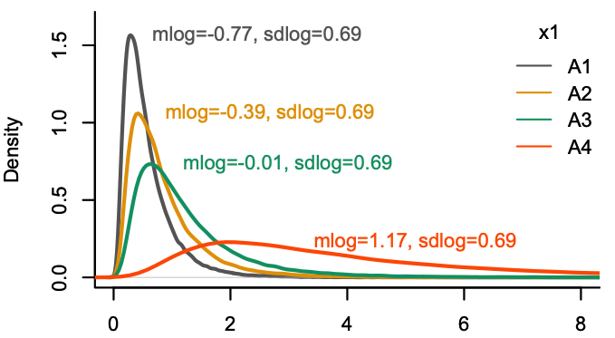

# Answer to the new response of Prof. James Higgins

Prof. Higgins admits that we are *"speaking past each other,"* but this is largely because our reviewer disregards our responses and fails to address our points. We enumerate the key claims he has made throughout his commentaries and summarize our replies. We pose precise questions in the hope that more neutral reviewers will evaluate our work fairly and, most importantly, that our community will quickly abandon the ART method.

### CLAIM 1 (Interaction effects under transformation)
In his initial commentary, Prof. Higgins argues that we *"misunderstood what interaction is fundamentally about."* Specifically, he claims that the difference in interaction detection between ART and other transformation methods arises because *"there can be interaction in the original data but no interaction in the transformed data, or vice versa."*

We respond that this is not the case in our example in Fig. 1, nor in our main experiments, where the effect is applied solely to the first factor. This indicates that ART's rejection of the null hypothesis for interaction in these cases constitutes a Type I error, regardless of whether the null hypothesis for interaction is defined with respect to the original data or the transformed data.

**Question 1:** Does Prof. Higgins still assert that an interaction effect can appear in monotonically transformed data when there is no interaction in the original data and no effect on the second factor? If so, could he explain how this is possible?

### CLAIM 2 (Main effects under transformation)
In his second commentary, Prof. Higgins argues: *"The authors seem to think that a test for a1 determines whether or not the main effect of factor 1 is significant and a test for a2 determines whether or not the main effect of factor 2 is significant. This can’t be true because these would be single degrees-of-freedom tests, which would be incorrect for any setup with more than 2 levels.*"

We respond that this claim is incorrect. When $a_2$ and $a_{12}$ are both zero, it is impossible to apply a monotonic transformation that produces a main effect on the second factor. We have also demonstrated this graphically using our simulation method, which shows that the transformed population distributions from which we draw samples are identical across the levels of the second factor.

**Question 2:** Does Prof. Higgins still believe that it is possible to apply a monotonic transformation and produce a main effect on the second factor when $a_2$ and $a_{12}$ are both zero? If so, could he explain how this is possible?

### CLAIM 3 (ART's no inflation of Type I error rates)
In his final commentary, Prof. Higgins argues that *"[the main issue] is whether the authors have shown that ART unacceptably inflates the Type I error rates. They have not."* 

This claim is surprising and overlooks our responses. ART's inflation of Type I error rates is not a matter of comparison with other methods. We explicitly set a null hypothesis and an $\alpha$ level, then demonstrate that ART rejects the null hypothesis at a rate far exceeding this level.

Moreover, the population distributions from which we draw samples do not merely have equal means across the second factor. They are identical. Yet, ART identifies them as different at a rate significantly higher than the nominal $\alpha$ level.

**Question 3:** Suppose we draw samples from the following population distributions, using the exact same distributions for all levels of $x_2$ (this is what our simulations simply do). If ART, or any other method, results in $p < \alpha$ for the main effect of $x_2$ (or its interaction with $x_1$), does Prof. Higgins believe that this a not a Type I error?

**Question 4:** In our previous response, we used the data from our illustrative example to conduct an experiment in which observations were randomly assigned to each level of Technique. We demonstrated that ART detects an effect of Technique at a rate of 39%, which is significantly higher than the nominal rate of 5%. Does Prof. Higgins believe that this simple experiment fails to demonstrate that ART inflates Type I error rates? Does he consider this behavior normal?

### CLAIM 4 (Incorrect comparison between methods)
Prof. Higgins claims: *"To compare the p-values of ART to those of the other methods, ART must be applied to the same data used to obtain the p-values of the other methods: original data for ART vs. PAR, logarithmic data for ART vs. LOG, unaligned rank data for ART vs. RNK, and inverse-normal transformed ranks for ART vs. INT."*

We are unclear on what Prof. Higgins is suggesting. Yes, if we make the distributions normal or first take ranks, ART will behave well. However this is not how ART is intended to function. We have not encountered any paper that applies ART to log-transformed or rank-transformed data.
 
We refer again Prof. Higgins to his own paper with Elkin et al. (2021): 

*"Since we know the data in our running example is drawn from a lognormal distribution, we fit a linear mixed model (LMM) to log-transformed data as a baseline, and fit an ART model to the original (not log-transformed) data."* (Page 757)

**Questions 5 (again):** We used the very same approach of Elkin et al. (2021) to illustrate ART's defects but identified instead a new set of more serious problems. Why is our interpretation "wrong" while theirs is correct?
