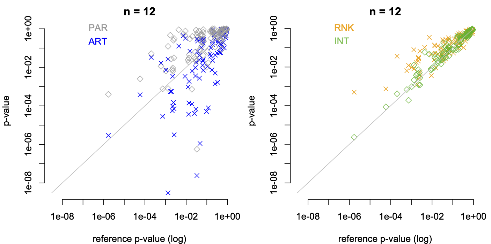

#  Reactions to Higgins' response to the challenge

We explain the pitfalls in Prof. Higgins reasoning and clarify that his claim - that we have not evaluated RNK and INT in the presence of interaction effects - is false.

### Prof. Higgins' data analysis
Our reviewer chose not to analyze the two datasets we provided (n=1000), instead focusing on the dataset from the article's example in Figure 1 (n=12). Is this because smaller datasets are easier to manipulate to creatively distort statistical results?

Prof. Higgins essentially makes the following claim (with our own words): *If ART provides strong evidence for an effect but no other statistical methods do, one can selectively remove observations from the data so that other methods also detect an effect.* We agree that it is always possible to artificially create an effect - even when no effect exists in the original population - by selectively removing observations.  

However, let’s examine our reviewer’s analysis in greater detail. Prof. Higgins argues that six "extreme observations" under Level 4 influence the results of PAR. These are our reactions.

**A first reaction:** Why are these observations considered extreme or outliers? These six cases make up 16.7\% of the total 36 observations under Level 4!

Moreover, Prof. Higgins selectively removes these observations in a way that exaggerates the random trend, creating an artificial effect in a specific direction. Specifically, he removes smaller values for Techniques A and B and larger values for Technique C. However, a closer examination reveals that the two largest values of Technique C that he removes are actually lower - not merely comparable - than the largest values of Techniques A and B. Similarly, the four smallest values of Techniques A and B are larger than the smallest value of Technique C.

We remind him that observations for all three techniques were drawn from **completely identical distributions.** Why does our reviewer refuse to accept this? Does he believe that an effect must exist simply because ART detects one?

**A second reaction:** In addition to the issue discussed above, Prof. Higgins makes another unfounded claim: *"The ranking in ART has the desirable property of down-weighting extreme observations, so p-values are not as negatively affected by a few extreme observations."*

Interestingly, he hides (why?) the fact that ART's *p*-values also change drastically (orders of magnitude) after these data are removed:

|        | ART (original data)  | ART (6 values removed)  |
|--------|------:|------:|
| Technique   | .00061 | .0000073  | 
| Difficulty $\times$ Technique | .0017 | .0000024 |

**A third reaction:** Prof. Higgins has avoided analyzing the challenge dataset we provided (where
n=1000). Why? Can he explain how he would identify and remove the "outliers" in this dataset?

But since comparing *p*-values on a single dataset may not be as convincing, we randomly generate 100 datasets for n=12, and 100 additional datasets for n=1000. All these datasets were drawn from log-normal distributions, with a large effect on one factor, no effect on the other factor, and no interaction effect. 

The following plots compare the *p*-values we obtain with PAR and ART for the factor with no effect:

These results are **deeply embarrassing for ART.** Can Prof. Higgins explain these systematic discrepancies? Aren't these failures clear examples of Type I errors? The *p*-values obtained with ART are highly erratic, with some reaching extremely low levels: 11\% of ART's *p*-values for n = 1000 are below .00001! 

Do such results demonstrate ART's robustness in the presence of outliers? Don't they instead demonstrate the exact opposite - a complete breakdown of ART under heavy-tailed distributions?

**A fourth reaction:** Our follow-up exercise highlights another scenario of ART's clear failure, this time with discrete ordinal data, where effects are null across all factors. However, despite our repeated requests for his position on this critical issue, Prof. Higgins continues to ignore us. Why? 

### On the use of LOG as baseline for log-normal data
Prof. Higgins continues to argue that we should not compare the results of ART or PAR to those obtained using LOG (for log-normal distributions), RNK, or INT. He even goes so far as to claim that the running example in Elkin et al. (2021), which also uses LOG as a baseline, is flawed. This reasoning leads to the conclusion that without a baseline, reliable comparisons to evaluate ART are impossible. Magic!

Let’s be very clear:

1. If the model's interaction term $a_{12}$ is zero, then conclusions about main effects should NOT change regardless of the scale used. (Of course, we refer to scales under strictly monotonic transformations, such as the logarithmic transformation and its inverse function.)

2. If either $a_1$ or $a_2$ is zero, then conclusions about the interaction effect should NOT change regardless of the scale used.

We have extensively explained why these statements are true, yet Prof. Higgins completely disregards our responses and avoids addressing our questions. Can he provide answers to Questions 1, 2, 3, and 4 from our [previous post](https://github.com/journalovi/2024-tsandilas-ranktransforms/issues/2#issuecomment-2564006376)?

**Conclusion:** If we are in one of the two situations described above and the data are log-normal, LOG is undoubtedly the best baseline for all methods. This is because LOG is expected to provide the best Type I error control and the greatest statistical power across all alpha levels. Therefore, comparing the $p$-values of PAR, RNK, INT, or ART to those of LOG in these cases makes perfect sense, regardless of Prof. Higgins' claims.

**Note:** Prof. Higgins' suggestion to use ART on transformed data (e.g., after applying LOG or RNK and INT) appears to be an artificial invention that can only confuse readers (is this its purpose?). We have not found a single instance of authors using it in that manner. Our reviewer seems to acknowledge its lack of practical utility, stating: *"my comments are not about whether ART is or is not a useful methodology..."* This obscure statement is particularly perplexing. Notice that Mansouri and Chang (1995), as well as other authors, directly compare ART with RNK in their experiments. 

### On the presence of a non-null interaction
Prof. Higgins adds .13 to observations with ``Difficulty = Level4`` and ``Technique = A`` to simulate an interaction effect. We did the same by adding the following R code prior to the analyses: 

``df$Time <- ifelse(df$Difficulty == "Level4" & df$Technique == "A", df$Time + .13, df$Time)``

These are the *p*-values we obtain:

|        | LOG  | RNK | INT | ART |
|--------|:------|:------|:------|:------|
| Technique   | .16 | .36  | .16 | .00069 |
| Difficulty $\times$ Technique | .084 | .21 | .20 | .0017 |

This is very different from what Prof. Higgins reports. This does not imply that there are no differences between the results of LOG and RNK (or INT) — of course, there are! However, these differences need to be evaluated over a larger number of samples. 

The following two plots compare the outputs of PAR, ART, RNK, and INT for the interaction effect with those of the baseline (LOG). We generate 100 datasets (using the same design as Fig. 1 with $n=12$), where $a_1=4$, $a_2=0$, and $a_{12}$ is randomly drawn from the range $[-2, 2]$. Anticipating potential reactions from Prof. Higgins, we emphasize that this comparison is entirely valid because $a_2=0$ (see above).

ART's *p*-values are highly inconsistent and, in many cases, extremely small. RNK and PAR generally tend to underestimate effects, resulting in larger p-values than LOG (with a few exceptions), while INT appears to provide the best control.

Prof. Higgins claims that we have not evaluated RNK and INT in the presence of interactions. This is incorrect:

1. **Power detecting interactions, when both $a_1$ and $a_2$ are zero.** Please, check [Figure 28](https://www.journalovi.org/2024-tsandilas-ranktransforms/#fig-power-interaction).

2. **Power detecting interactions, as $a_2$ increases while $a_1 = 0$.** Please, check [Figure 40 in our Appendix](https://www.journalovi.org/2024-tsandilas-ranktransforms/appendix.html#fig-vdWaerden-power-interactionB), where we compare RNK and INT against the methods recommended by Lüpsen (2018; 2023). We show the issues of these latter methods (see results for between- and mixed-subject designs) and demonstrate INT's superiority across all scenarios. We observe that RNK's power in detecting interactions also drops as the main effect increases, and our recommendations consider these issues. (*Note: Including ART in this comparison would make little sense, given its high Type I error rate for these scenarios.*)

3. **Type I error rate of main effects in the presence of interactions.**  Please, check [Appendix - Section 2](https://www.journalovi.org/2024-tsandilas-ranktransforms/appendix.html#interactions). In this specific case, we acknowledge that interpreting the null hypothesis becomes more challenging because main effects are influenced by the presence of interaction when scales change. Our experiments evaluate the methods with respect to the model parameters (which we believe is the most meaningful approach), but we will revise this section to clarify the interpretation issues. However, we invite our reviewer to carefully read our nuanced conclusions in this section regarding RNK and INT:
*"The performance of INT and RNK can also be affected by the presence of interaction effects, especially when the interaction effect is combined with a main effect, and distributions are either binomial or ordinal. More generally, main effects should be interpreted with caution when strong interactions exist."*

### Other comments
Prof. Higgins provides a lecture on the history of ANOVA but misleads readers in the process. He writes:

*"Thus, the notion that ART has limited applicability because it is based on this model [ANOVA], as asserted by the authors in one of their responses, is not born out in practice. In view of the authors’ criticism of ART as having limited applicability, it is ironic ..."*

We **never argued** that *"ART has limited applicability because it is based on ANOVA."* Instead we stated - and empirically demonstrated - that its applicability is limited because it relies on a set of "alignment" calculations (see [Figure 2](https://www.journalovi.org/2024-tsandilas-ranktransforms/#fig-ART-explained)) that only work under very specific conditions. ART is a Frankenstein method. As far as we know, these alignment calculations have no connection to Fischer's work, and we are not aware of any theoretical justification for their use with generalized linear models and discrete data. 

Regarding INT, we have conducted a large number of experiments and, despite INT's limitations (which we clearly identify and caution researchers about), all other so-called "nonparametric" methods for multifactorial designs found in the literature - including ART, ATS, and Lüpsen's generalization of non-parametric tests - were shown to perform worse than INT. 

We also encourage our reviewer to review our recommendations on the use of nonparametric methods. We explicitly state that such methods should only be used as "last-resort" solutions. In contrast, ART should never be used, as it can very easily lead to fundamentally flawed conclusions. The ARTool has been polluting HCI empirical research for many years, and this may not change if ART's authors continue to obscure its problems. In some domains such as VR/AR, reviewers frequently request authors to replace their analyses with nonparametric analyses using ART — **this practice must stop!**
