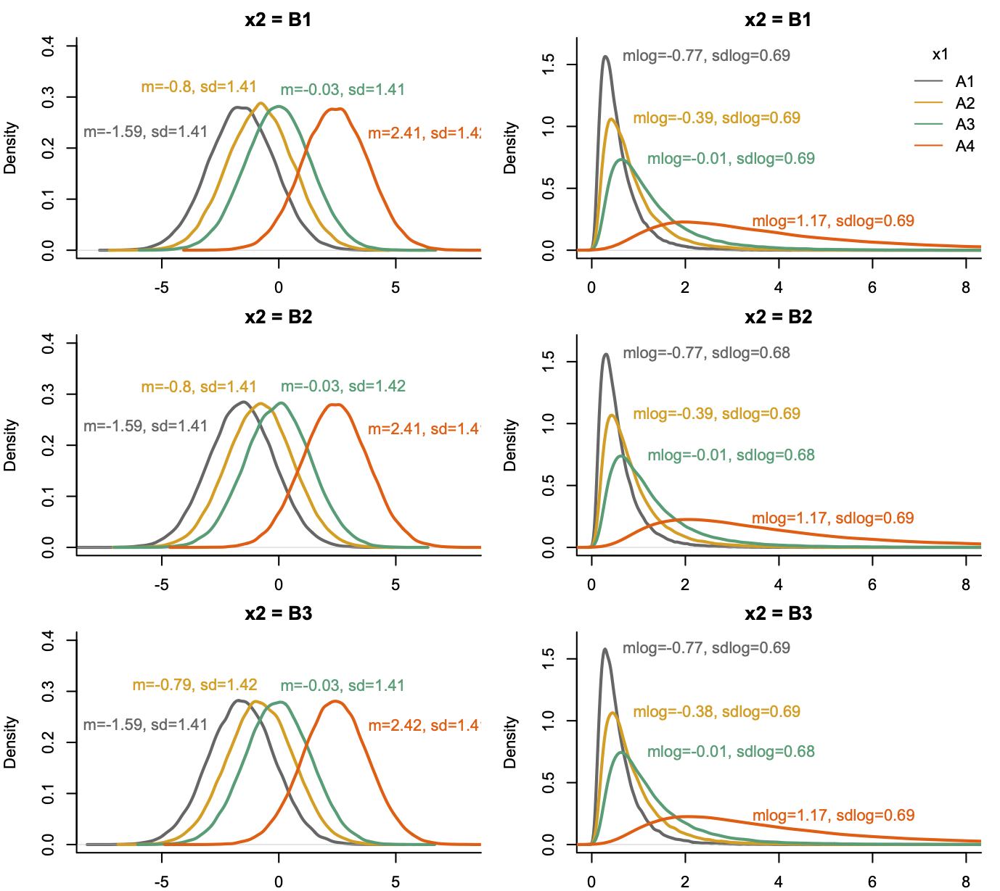

# Answer to the response of Prof. James Higgins

We thank Prof. Higgins for his quick response. We explain why his argumentation is not correct and why our simulation approach does not introduce any spurious effects. We suggest some alternative, very simple simulation tests that the authors of ART can quickly conduct to confirm that ART completely fails.

The code, raw results, and figures supporting our responses are provided in the [supplementary materials](https://github.com/journalovi/2024-tsandilas-ranktransforms/tree/main/supplementary/rebuttals/higgins).

## Analysis of the data of Fig. 1 and Fig. 2
Prof. Higgins uses ART to analyze the log-transformed values of Fig. 1 and Fig. 2 and reaches the following conclusion:  

*"If ART is applied to the logarithms, the p-values for ART show no inflation of Type I errors but instead are consistent with the model used to generate the data, namely, a log-normal model with only a main effect for level of difficulty and no interaction."*

We definitely agree. There is no surprise because the data are log-normal, so the LOG transformation makes the distributions normal. And as we have also demonstrated, ART behaves well under normal distributions (as long as variances are equal). 

The problem is that ART **is claimed** to work correctly when applied directly on log-normal data, or data following other non-normal distributions. We refer Prof. Higgins to his own paper, coauthored with Elkin  et al. (2021):  

*"We demonstrate these issues using our running example. Since we know the data in our running example is drawn from a lognormal distribution, we fit a linear mixed model (LMM) to log-transformed data as a baseline, and fit an ART model to the original (not log-transformed) data."* (Page 757)

And this is how the authors demonstrate that the original version of ART fails to correctly infer contrasts. Later, the authors return to their running example to show that the results of their corrected ART-C method (applied to values that are not log-transformed) gives results that are consistent with the LOG method (see their Table 10).  

So we used the very same approach of Elkin  et al. (2021) to illustrate ART's defects but identified instead a new set of more serious problems. Why is our interpretation "wrong" while theirs is correct? 

## Simple tests that demonstrate ART's failure
Since Prof. Higgins believes to have found a flaw in our simulations, let us evaluate ART with a different but very simple type of simulation experiment, inspired by permutation tests. 

**Data preparation.** We take the data of our illustrative example but to simplify our analysis and presentation, we remove the *Participant* column, so we consider a scenario where all observations are independent. In addition, to ensure that we eliminate any spurious bias regarding the effect of *Technique* (e.g., due to hypothetical flaws of our original simulation approach), we remove the *Technique* column before we run our tests. [This is the dataset](https://github.com/journalovi/2024-tsandilas-ranktransforms/blob/main/supplementary/rebuttals/higgins/permutation-tests/example-data-1-simplified.csv), available for our readers to conduct these tests with their own code. 

**Simulation method.**  We repeat the following two steps a large number times: 

- *Step 1*: We recreate the *Technique* column by randomly assigning the values at each level to the three techniques *A*, *B*, and *C*, where we make sure that the design is balanced, i.e., there are exactly 12 observations for each combination of difficulty level and technique.  

- *Step 2*: We conduct and an analysis with all five methods (PAR, LOG, RNK, INT, and ART). For instance, we use the following formula for LOG: `aov(log(Time) ~ Difficulty*Technique, data=df)`. For all three effects (*Difficulty*, *Technique*, *Difficulty* x *Technique*), we assess whether the methods reject the null hypothesis ($\alpha = .05$). 
 
We then calculate the rate of rejections of the null hypothesis over all the iterations. For *Difficulty*, we interpret the rate as power, since we know that there is a large effect across difficulty levels. In contrast, for *Technique* and its interaction with *Difficulty*, we interpret it as a Type I error rate, simply because the assignment of techniques to observations was random. We hope this interpretation is clear, as randomization is applied directly to the responses without any transformation.

For 5000 iterations, these are our results:

|        | PAR  | LOG  | ART | RNK | INT |
|--------|------:|------:|-----:|-----:|-----:|
| Difficulty  | 100.0 | 100.0  |  100.0 | 100.0 | 100.0 |
| Technique   | 5.5 | 5.2  | 39.0 | 5.1 | 5.1 |
| Difficulty $\times$ Technique | 10.7 | 5.1 | 22.8 | 5.3 | 5.5 |
: % rates of positives ($\alpha = .05$) {.sm}

ART detects a main effect of *Technique* with an error rate of 39% and an interaction effect with an error rate of 22.8%! We observe that PAR also struggles with the interaction but to a lesser degree. 

But let us observe a more problematic situation, where we add an additional spurious variable (*Birthseason*) to represent the season of participants' birth (1 = spring, 2 = summer, 3 = autumn, 4 = winter). We just add a new column to the data, where each row takes a random value in this range. The design is partly imbalanced now, so it is not a surprise that ART fails even more seriously:

|        | PAR  | LOG  | ART | RNK | INT |
|--------|------:|------:|-----:|-----:|-----:|
| Difficulty  | 100.0 | 100.0  |  100.0 | 100.0 | 100.0 |
| Technique   | 6.0 | 4.8 | 42.0 | 5.1 | 4.7 |
| Birthseason | 6.4 | 5.5 | 72.1 | 5.2 | 5.1 |
| Difficulty $\times$ Technique | 10.1 | 5.5 | 25.6 | 4.9 | 5.6 |
| Difficulty $\times$ Birthseason | 10.6 | 5.1 | 28.4 | 4.9 | 4.9 |
| Technique $\times$ Birthseason | 7.8 | 4.2 | 87.4 | 4.4 | 4.5 |
| Difficulty $\times$ Technique $\times$ Birthseason | 15.4 | 5.2 | 32.2 | 5.5 | 5.3 |
: % rates of positives ($\alpha = .05$) {.sm}

ART's error rates are enormous! The method can easily lead to extremely fallacious conclusions. The authors of ART may complain here that the ARTool issues a warning when imbalances in the design arise. We agree, but such imbalances occur very frequently in real studies, and we have observed that many HCI authors completely ignore this warning. Prof. Higgins may notice that RNK and INT behave very well in such situations, and we can show that they remain precise even if we consider a lower significance level $\alpha = .01$. 

The failures of ART are of course not specific to this dataset. For example, if we use [the dataset](https://github.com/journalovi/2024-tsandilas-ranktransforms/blob/main/supplementary/rebuttals/higgins/permutation-tests/example-data-2.csv) we analyzed in our previous answer (sampled from homoscedastic log-normal populations), we find the following results for perfectly balanced designs:

|        | PAR  | LOG  | ART | RNK | INT |
|--------|------:|------:|-----:|-----:|-----:|
| Difficulty  | 100.0 | 100.0  |  100.0 | 100.0 | 100.0 |
| Technique   | 4.6 | 4.9  | 13.4 | 4.8 | 4.7 |
| Difficulty $\times$ Technique | 2.8 | 6.4 | 10.7 | 5.1 | 5.5 |
: % rates of positives ($\alpha = .05$) {.sm}

The conclusions are clear. ART's failure is not due to any wrong interpretations. As we explained in our previous answer, ART's alignment method is based on the assumption that the shape of the distribution (log-normal here) is identical across all factor levels. This is not the case in these datasets where distribution shapes change across difficulty levels, causing the method to break down. 

Our R code for these tests is available [here](https://github.com/journalovi/2024-tsandilas-ranktransforms/tree/main/supplementary/rebuttals/higgins/permutation-tests).

## Validity of our original simulation approach
Prof. Higgins argues that our simulation method produces an effect on factor 2 even if a2 is zero, and despite the fact that the interaction term a12 is also zero. This is incorrect. Our reviewer does not provide any logical reasoning to support his argument. 

Consider the following model: $f(Y) = \alpha_1 x_1 + \epsilon$

where $\epsilon$ is a random error and $f$ is a monotonic function. Prof. Higgins argues that it is possible that $Y = f^{-1}$ depends on $x_2$ despite the fact that the variable is absent in the above equation. By extension, one can argue that $Y$ will also depend on any spurious variable that we may decide to include: $x_3, x_4, x_5, ...$ But unless there is a serious bug in our code, how could this be possible?

To reassure our readers that there is no such bug, we demonstrate how exactly our simulation generates data distributions, focusing again on log-normal data. We concentrate on a 4x3 within-subjects design, where $a_1 = 4$, $a_2=0$, and $a_{12}=0$. We then use our experimental code to: 

1. Draw a very large sample `n=100000` using our model (Equation 2). The left column of the figure below shows the produced normal distributions at each combination of the two factors. The curves in the figures are kernel density estimates produced using R's `density` function. We also show the mean and standard deviation estimates of these distributions based on our sample. We clearly see that the distributions are identical across all levels of the second factor $x_2$ (tiny differences are due to sampling error). 

2. Transform the sample based on the approach we describe in the paper. For our `norm2lnorm` function, we use the parameters `meanlog = 0` and `sdlog = 1`. The right column of the figure shows the estimated curves of the transformed distributions. We show again the estimated parameters of the distributions, knowing that they are log-normal. We clearly see again that the distributions are identical across all levels of the second factor $x_2$ --- its main effect remains null and there is no interaction.  

We can run the same test with other $a_1$ values and other distributions. Conclusions will not change. Our simulation method does not introduce any spurious effects. [We provide our code](https://github.com/journalovi/2024-tsandilas-ranktransforms/tree/main/supplementary/rebuttals/higgins/simulation-method) that generates these plots, so that our readers can conduct their own tests. 

## Other comments
Finally, we reply to the additional comments of our reviewer: 

- *"I believe the authors incorrectly compare the p-values for ART vs. PAR for Fig. 1 data."*\
Please, see our analyses above. The comparison is both correct and fair.

- *"The use of RNK and INT for factorial data is questionable. I would never recommend these procedures for multi-factor data."* \
We aimed to provide balanced recommendations for these methods, explaining that they too can fail in certain scenarios. Our article actually recommends that *"there are valid reasons to prioritize parametric methods and reserve rank transformations as last-resort solutions."* However, RNK and INT are significantly superior to ART in most respects, and unlike ART, we believe they remain useful tools if they are appropriately used.

- *"The authors' strong condemnation of ART is not supported by their own literature review (in particular the results obtained by Elkin)."* \
Please read our [previous response](https://github.com/journalovi/2024-tsandilas-ranktransforms/issues/2#issuecomment-2483020115) carefully. There is no contradiction between our results and those of Elkin et al. (2021). Their experiments did not examine how a main effect on one factor could lead ART to falsely detect effects on other factors. Moreover, their evaluations were limited to continuous distributions and did not include comparisons of ART with other rank-based methods. Prof. Higgins also overlooks the condemning findings of Lüpsen (2017, 2018), which Elkin et al. (2021) failed to cite.

- *"The authors' model (2) is not the ANOVA model upon which ART is based. This creates more misleading apples-to-oranges comparisons."* \
This is a standard mixed-effects model (e.g., see DeBruine and Barr, 2021), which can describe the full set of experimental designs that we address in this paper: between-subjects, within-subjects, and mixed designs that combine a between- and a within-subjects factor. We use the [faux simulation package](https://debruine.github.io/faux) to generate data with this model, and our use of the `art()` function (ARTool R package) is fully consistent with the model parameters. For example, if the random intercept term $s_k$ is relevant, we include a `(1|S)` term in the formula, and apply the same approach to the other methods when calling the *lmer* function. This approach aligns perfectly with the analysis by Elkin et al. (2021). Can our reviewer clarify his concerns? What aspects of our model are misleading?

- *"The rebuttal to my original comments suggests that interaction can be defined in more than one way. However, when formulated in terms of means of treatments, there is no ambiguity. The authors might want to define interaction some other way, but let's be certain that the parameters that are being tested by the various methods are for the same parameters."* \
We explained that interaction interpretation issues arise ONLY when all parameters of the interacting factors (e.g., $a_1$ and $a_2$ for a two-factor design) are non-zero. As we mentioned in our [earlier message](https://github.com/journalovi/2024-tsandilas-ranktransforms/issues/2#issuecomment-2507452242), we will create a separate results section specifically for cases with interpretation issues to prevent further confusion.

- *"The authors proposed revisions suggest that ART is very limited in its applicability which is not true. Every one of the methods that the authors propose to use are ANOVA models. They only differ in the data to which they are applied. In every case, ART may be correctly applied provided it is applied to the same data that their methods are applied to."*\
The key distinction of ART lies in its alignment method. Our results demonstrate that this alignment method fails when the data deviate from the specific model described by Prof. Higgins in his previous response. Please check the strict assumptions of Mansouri and Chang (1995) in their proof. Is Prof. Higgins aware of any theoretical work demonstrating that this same alignment method remains valid for generalized linear models, which involve nonlinear functions, discrete data, or ordinal scales? Are there any positive findings supporting its robustness in such cases? Given our results, how can Prof. Higgins remain so confident in its applicability?

As a final comment on our reviewer's concluding remarks that ART is *"just a rank-based extension of ANOVA,"* we present the following plots, which visualize the relationship between the original responses in our example from Fig. 1 and their rank transformations using RNK and ART: 

The plots show ART's rankings with respect to both *Difficulty* (center) and *Technique* (right). Notice how radically ART transforms the data prior to applying ANOVA. Unfortunately, such complex transformations introduce numerous opportunities for errors and distortions.  
